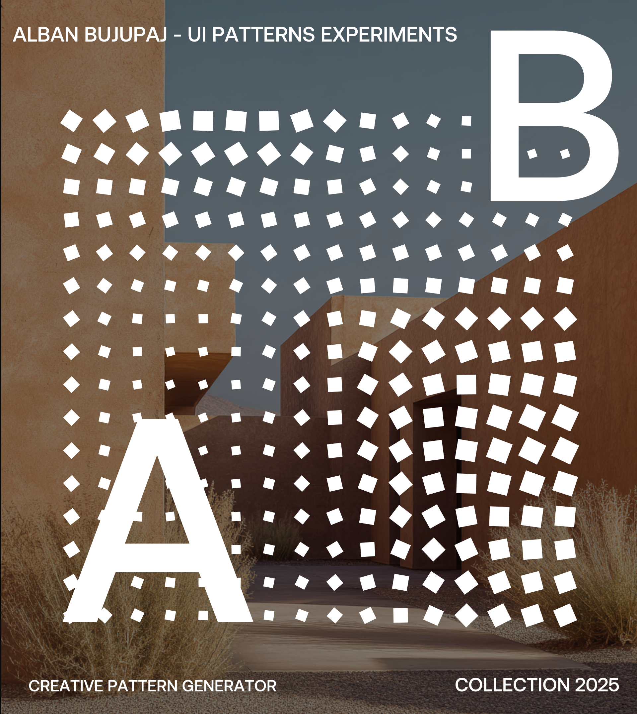
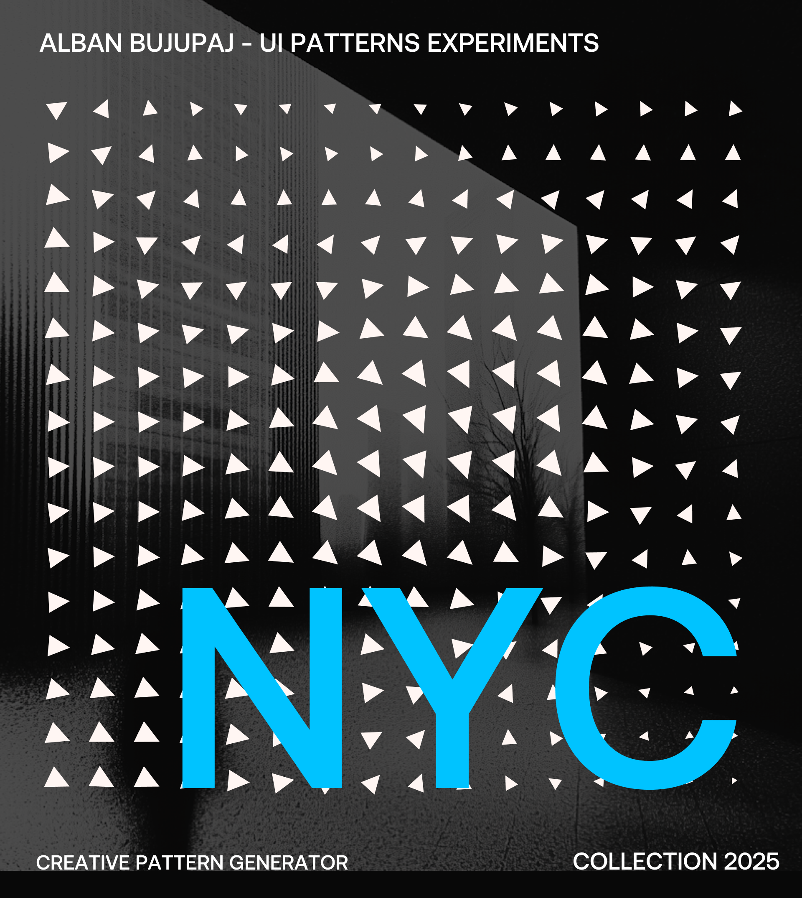
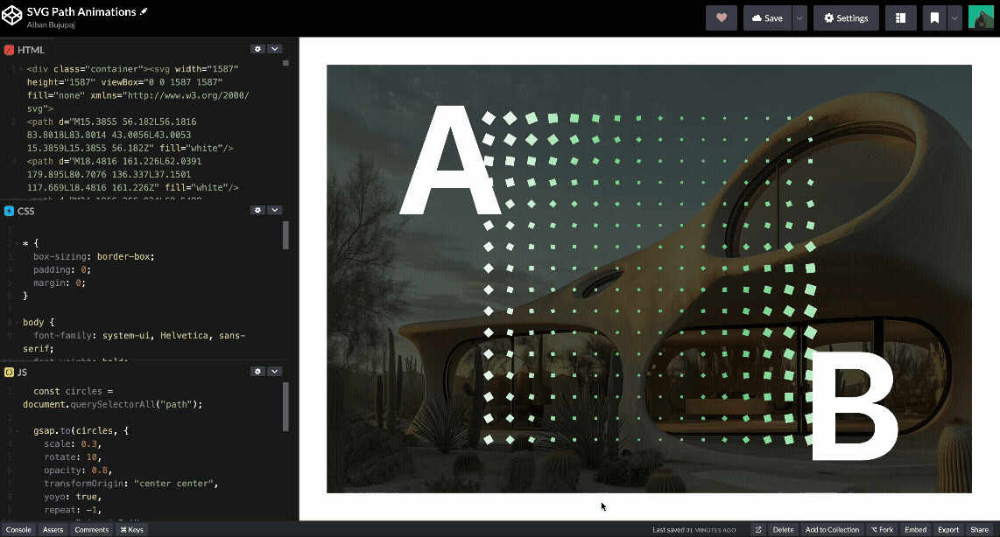

# 🎨 SVG Pattern Generator

A generative art tool built with **React** and **svg.js** for creating beautiful noise-based patterns using lines, dots, squares, and triangles. Includes full customization, SVG export, and clipboard copy functionality.

## Sample Design Generated Pattern

  
  

---

##  Live 

[Live Demo](https://svg-generate-creative-pattern.vercel.app)

## Example Where can be used to animate shape 

  

[Example Animated Shape Generated using this tool -  Check on Codepen](https://codepen.io/abujupaj/pen/JodQwMY)
---

## ✨ Features

- ✅ Multiple shape modes: **Lines**, **Dots**, **Squares**, **Triangles**
- 🎛️ Configurable:
  - **Cell size**
  - **Noise variance**
  - **Color**
  - **Line width** (for line mode)
- 🧠 Noise-based transformation using `simplex-noise`
- 📋 Copy SVG markup to clipboard
- 💾 Download artwork as an **SVG file**
- ⚙️ Debounced input handlers for smooth UX

---

